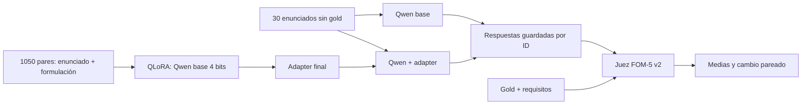

# Deliverable 2 · Formulación LP/MILP con QLoRA

**[Abrir el notebook en Colab](https://colab.research.google.com/github/Jose21531/GenAI-Optimization/blob/main/Deliverable%202/Deliverable_2.ipynb)** · [Informe PDF](report/informe.pdf) · [Fuente LaTeX](report/informe.tex) · [Adapter entrenado](model/adapter_qlora_qwen25_final.zip)

## Problema e intervención

Formular un problema de localización, asignación o capacidad exige traducir sus decisiones y límites a índices, dominios, función objetivo y restricciones coherentes. Un error puede cambiar el conjunto factible o el criterio que se optimiza. La Entrega 1 mostró un fallo concreto en localización de centros oftalmológicos: Qwen omitió la apertura de centros y la ponderación por población, y escribió condiciones contradictorias de asignación. La salida buscada es una **formulación paramétrica**, sin resolver el óptimo.

Elegimos **Qwen/Qwen2.5-1.5B-Instruct**, revisión de pesos `989aa7980e4cf806f80c7fef2b1adb7bc71aa306`. Tiene 1.5B parámetros, frente a los 2B de Gemma-2-2B-IT y 3.8B de Phi-3-mini considerados en la Entrega 1, y se adapta y ejecuta en una T4. Se probaron previamente one-shot, representación intermedia IR/JSON/DSL, blueprint y autorrevisión; persistieron errores estructurales o repetición. Esas pruebas guiaron el diseño, sin constituir una ablación nueva.

**QLoRA** es adaptación de bajo rango sobre un modelo cuantizado (*Quantized Low-Rank Adaptation*). Mantiene congelados los pesos base en 4 bits y entrena matrices pequeñas añadidas a las capas de atención y MLP. El ajuste final usó LoRA `r=16`, `alpha=32`, pérdida solo en la respuesta, 1050 ejemplos, una época, semilla 42 y T4 (131 pasos, 982 s, 9.04 GiB reservados). El [adapter](model/README.md) y el modelo base público se cargan desde el notebook sin acceso al Drive del equipo.

## Flujo y archivos

| Ruta | Contenido |
|---|---|
| [`data/train_1050_user_only.jsonl`](data/train_1050_user_only.jsonl) | 1050 conversaciones user/assistant: 50 familias × 21 variantes, 315 LP y 735 MILP. Hay 50 formulaciones canónicas. |
| [`data/benchmark_30_generation_only.jsonl`](data/benchmark_30_generation_only.jsonl) | Las 30 entradas oficiales que ven ambos generadores, sin soluciones ni requisitos. |
| [`data/caso_entrega1_generation_only.jsonl`](data/caso_entrega1_generation_only.jsonl) | Caso oftalmológico del video, separado de la media principal. |
| [`outputs/baseline_31_respuestas_y_fom5.csv`](outputs/baseline_31_respuestas_y_fom5.csv) | Respuestas y juicios base recuperados del CSV original: 30 benchmark + 1 diagnóstico determinista. |
| [`outputs/qlora_31_respuestas_y_fom5.csv`](outputs/qlora_31_respuestas_y_fom5.csv) | Respuestas y juicios de la corrida final QLoRA sobre esos mismos IDs. |

Los dos CSV de salida incluyen el texto completo (`candidate`), puntaje y dimensiones FOM-5 v2, juicio bruto, tokens y tiempos. [`data/source/`](data/source/) conserva el ZIP sintético y el benchmark con referencias para auditoría. [`data/build_datasets.py`](data/build_datasets.py) reconstruye los JSONL publicados desde esas fuentes; el generador original que redactó desde cero las 30 instancias y las 50 familias no se entregó. [`src/build_outputs.py`](src/build_outputs.py) reconstruye ambos CSV a partir de los resultados originales. Los **SHA-256** son huellas digitales de los bytes de archivos: el notebook comprueba que datos y adapter descargados coincidan con la versión publicada. No miden calidad matemática.

## Cómo se calcula FOM-5 v2

**FOM-5 v2** es la rúbrica propia del proyecto para juzgar formulaciones en escala **0–5**. Un juez Qwen3-14B NF4 recibe en una fase posterior el enunciado, la referencia, los requisitos y la respuesta candidata; el generador solo recibe el enunciado. Se aceptan formulaciones algebraicamente equivalentes y se penalizan omisiones, contradicciones y respuestas que resuelven en vez de formular.

| Componente | Símbolo | Peso |
|---|:---:|---:|
| Decisiones, índices y dominios | D | 15 % |
| Función objetivo | O | 20 % |
| Restricciones y lógica | R | 35 % |
| Validez algebraica | A | 15 % |
| Generalización paramétrica | G | 15 % |

Cada componente se puntúa de 0 a 5. El resultado es `F = 0.15D + 0.20O + 0.35R + 0.15A + 0.15G`. Además, cada requisito de referencia se marca como cumplido (`1`), parcial (`0.5`), ausente (`0`) o erróneo (`0`): su cobertura limita los puntajes de decisiones/dominios, objetivo y restricciones. Si no hay formulación matemática reconocible, el score total queda como máximo en `1.5`. El notebook original del [evaluador autoritativo](evidence/evaluador_fom5_local.ipynb) y sus juicios están archivados.

La media principal es el promedio de los **30 scores** de cada variante. El cambio pareado se calcula por ID (`score_QLoRA - score_base`) y después se promedian esos 30 cambios. El IC bootstrap remuestrea esos cambios 10 000 veces con semilla 42; lo calcula el análisis **después** del juez. No refleja variación entre entrenamientos ni entre jueces.

## Resultados y límites

| 30 casos oficiales | Base | QLoRA |
|---|---:|---:|
| FOM-5 v2 medio | 0.5884 | 0.8024 |
| Puntaje cero | 21 | 12 |

**14 mejoraron, 8 empataron y 8 empeoraron.** Cambio medio +0.2140/5; IC bootstrap 95 % `[-0.2136, +0.7007]`. Al incluir cero, el cambio observado no establece una mejora robusta. El diagnóstico de Entrega 1 se informa aparte: histórico muestreado 0.369, baseline determinista 0.650 y QLoRA 3.850. QLoRA aún omite el peso poblacional `p_j` del objetivo. En [`opt_02`](docs/failure_case_opt02.md) bajó de 1.300 a 0.000 por inventar variables y omitir una entrega mínima.

Los 1050 enunciados comparten 50 formulaciones canónicas y varias familias tienen estructura similar. Se realizaron dos pilotos 160/40; por límite de GPU se omitió la etapa 840/210 prevista antes de la corrida completa. El diagnóstico se usó durante el diseño y tres casos oficiales (`opt_01`, `opt_16`, `opt_30`) tenían exposición histórica previa. Una semilla final y un juez automático limitan la conclusión. Véanse la [auditoría de datos](docs/dataset_review.md) y el [protocolo](docs/experimental_protocol.md).

## Reproducir el video y el experimento

1. Abre [el Colab](https://colab.research.google.com/github/Jose21531/GenAI-Optimization/blob/main/Deliverable%202/Deliverable_2.ipynb) y selecciona GPU T4. Ejecuta las secciones **1–3**: instala dependencias, descarga datos y adapter con SHA-256, muestra resultados archivados y carga el SLM.
2. Ejecuta la sección **5** sobre el caso oftalmológico. Genera baseline directo con el adapter apagado y QLoRA con el adapter encendido, con la misma entrada y decodificación. El notebook guarda ambas respuestas nuevas en `/content/deliverable_2/outputs/live_demo.json` y las muestra lado a lado. Los scores del diagnóstico publicados corresponden a las respuestas archivadas.
3. Para repetir la evaluación extensa, activa `RUN_REGENERATE_30=True` en la sección **4**. Genera y guarda 30 baseline y 30 QLoRA por ID, con reanudación. Después de la demo, activa `RUN_JUDGE_NEW_30=True` en la sección **6**: descarga la referencia solo entonces, calibra el juez y guarda dos nuevos CSV puntuados. Estas corridas pueden consumir bastante tiempo de T4 y quedan identificadas por separado.
4. La sección **7** permite reentrenar el adapter desde los 1050 ejemplos. Los notebooks originales de [entrenamiento](src/qlora_user_only_original.ipynb), [generación](src/generacion_final_original.ipynb) y [juicio](src/evaluacion_final_original.ipynb), con sus manifiestos en [`evidence/`](evidence/), documentan la corrida que produjo los resultados publicados.

El video real de pantalla (máximo tres minutos) se añadirá en [`video/`](video/). Muestra únicamente las dos generaciones del caso de Entrega 1 y su comparación; la ejecución de 30 + 30 y el juez se revisan en el notebook y en sus archivos de salida.
