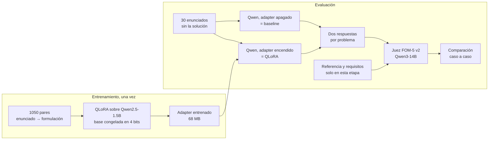

# Deliverable 2 · Fine-tuning con QLoRA para formular problemas de optimización

**[Abrir el notebook en Colab](https://colab.research.google.com/github/Jose21531/GenAI-Optimization/blob/main/Deliverable%202/Deliverable_2.ipynb)** · [Informe de una página (PDF)](informe.pdf) · [Fuente LaTeX](informe.tex) · [Revisar los 30 casos](casos_benchmark.md)

## Contenido

1. [Objetivo y justificación](#1-objetivo-y-justificación)
2. [Por qué falla el modelo original](#2-por-qué-falla-el-modelo-original)
3. [Elección del modelo](#3-elección-del-modelo)
4. [Solución implementada: QLoRA](#4-solución-implementada-qlora)
5. [Pipeline](#5-pipeline)
6. [Resultados en el benchmark](#6-resultados-en-el-benchmark)
7. [Caso de falla](#7-caso-de-falla)
8. [Archivos](#8-archivos)
9. [Reproducir el video y el experimento](#9-reproducir-el-video-y-el-experimento)

---

## 1. Objetivo y justificación

La programación lineal y lineal entera se usa para decidir cómo producir, dónde ubicar instalaciones, cómo asignar personal o qué rutas seguir. Antes de resolver cualquiera de estos problemas hay que **formularlo**: identificar las decisiones, los datos, el objetivo y las reglas, y escribirlos con conjuntos, índices y restricciones que sean coherentes entre sí. Esta etapa concentra buena parte del tiempo y de los errores del trabajo de modelación.

Un sistema capaz de proponer un primer borrador correcto de la formulación tendría valor en tres frentes:

- **Investigación y trabajo técnico:** podría reducir el tiempo dedicado al primer borrador algebraico y concentrar el trabajo experto en revisarlo y ajustarlo.
- **Educación:** un estudiante puede comparar su formulación con una propuesta y discutir las diferencias, como apoyo en cursos de investigación de operaciones.
- **Decisiones en empresas:** acerca estas herramientas a equipos sin especialistas en optimización, que podrían describir su problema en lenguaje natural y obtener un modelo revisable.

Para estudiar ese uso, elegimos un modelo **pequeño y abierto** que se ejecuta en una GPU T4 de Colab. La salida buscada es una formulación **paramétrica y verificable**: conjuntos, parámetros, objetivo y restricciones con índices coherentes.

## 2. Por qué falla el modelo original

En la Entrega 1 se le entregó a Qwen2.5-1.5B-Instruct, con prompting directo, un problema de localización: elegir 2 de 3 lugares para instalar centros oftalmológicos y asignar 5 sectores de demanda minimizando la distancia ponderada por población. La formulación esperada es:

$$
\begin{aligned}
\min\quad &\sum_{i\in I}\sum_{j\in J} p_j d_{ij}x_{ij}\\
\text{s.a.}\quad &\sum_{i\in I}x_{ij}=1 &&\forall j\in J,\\
&x_{ij}\le y_i &&\forall i\in I,\ j\in J,\\
&\sum_{i\in I}y_i=2,\\
&x_{ij},y_i\in\{0,1\}.
\end{aligned}
$$

Esta síntesis conserva las ecuaciones relevantes de la [respuesta original del modelo](../Deliverable%201/Deliverable_1.ipynb):

```text
Variables de Decisión:
- x_ij = 1 si el sector j está asignado al sitio i, 0 en caso contrario

Función Objetivo:
  min Σ_{i∈L} Σ_{j∈S} d_ij x_ij

Restricciones:
1. Solo se instalan exactamente 2 centros:   Σ_{i∈L} x_ij = 2   ∀ j ∈ S
2. Cada sector asignado a un único centro:   Σ_{i∈L} x_ij = 1   ∀ j ∈ S
3. No asignar a sitios no disponibles:       x_ij = 0   ∀ i ∉ L, j ∈ S
4. Asignación de poblaciones:                Σ_{j∈S} P_j x_ij = P_i   ∀ i ∈ L
```

La respuesta identifica los elementos del problema, pero falla al **construir su estructura algebraica**:

- **Le falta una decisión.** No crea la variable de apertura `y_i` ("se construye un centro en i"). Sin ella no puede expresar "se instalan exactamente 2 centros", y lo escribe sobre la variable de asignación: la restricción 1 pide que cada sector tenga 2 centros y la 2 que tenga 1, lo que es contradictorio.
- **Olvida un dato del objetivo.** Declara la población `P_j`, pero minimiza solo la distancia, sin ponderarla por población, que era lo que pedía el enunciado.
- **Inventa restricciones sin sentido.** La 3 se refiere a sitios que no existen, y la 4 compara la población atendida con una "población del sitio" `P_i` que no está definida.

El error central es mezclar la decisión de abrir un centro con la de asignarle sectores; la formulación correcta las separa y las vincula con `x_ij ≤ y_i`. Esta falla motivó el ajuste de la Entrega 2.

## 3. Elección del modelo

En la Entrega 1 se compararon tres candidatos. Nos quedamos con **Qwen/Qwen2.5-1.5B-Instruct** (revisión `989aa7980e4cf806f80c7fef2b1adb7bc71aa306`):

| Modelo | Parámetros | GSM8K | MATH | HumanEval | Falla observada en el caso de la Entrega 1 |
|---|---:|---:|---:|---:|---|
| **Qwen2.5-1.5B-Instruct** | **1,5B** | 73,2 | **55,2** | **61,6** | Asignación en una dimensión, sin variable de apertura y sin población en el objetivo |
| Gemma-2-2B-IT | 2B | 24,3 | 16,0 | 20,1 | Colapsa los índices; no expresa cardinalidad ni vinculación |
| Phi-3-mini | 3,8B | 82,5 | 41,3 | 58,5 | Confunde índices y decisiones; inventa restricciones |

- **Es el más pequeño**, lo que favorece la economía del modelo, y deja memoria libre en la T4 para entrenarlo.
- **Tiene el mejor desempeño en matemática simbólica y código** (MATH y HumanEval), que es lo más cercano a escribir álgebra con índices.
- **Duplicar el tamaño no resolvió el problema:** Phi-3-mini, con 2,5 veces más parámetros, cometió errores del mismo tipo. Eso sugiere que la falla no se corrige solo con un modelo más grande y justifica intervenir sobre el más pequeño.

## 4. Solución implementada: QLoRA

### Qué es

El *fine-tuning* consiste en seguir entrenando un modelo ya existente con ejemplos de la tarea, en este caso pares "enunciado → formulación correcta". Entrenar los 1.500 millones de parámetros del modelo no cabe en una T4, por lo que usamos **QLoRA** (*Quantized Low-Rank Adaptation*):

- El modelo original se **congela** y se guarda comprimido en 4 bits para ocupar menos memoria.
- Se agregan matrices pequeñas (**adaptadores LoRA**) en las capas de atención y MLP, y solo esas se entrenan. Son el 1,2 % de los parámetros, unos 68 MB frente a los 3 GB del modelo.
- Al generar, el modelo usa sus pesos originales más la corrección aprendida por el adaptador. El adaptador se puede **apagar**, y en ese caso el modelo es exactamente el baseline.

Configuración: LoRA `r=16`, `alpha=32`, pérdida calculada **solo sobre la respuesta** (el modelo aprende a formular, no a repetir enunciados), 1050 ejemplos, una época, semilla 42. Entrenamiento en T4: 131 pasos, 982 s, 9,04 GiB de memoria.

### Por qué esta intervención

El diagnóstico mostró errores estructurales persistentes en las pruebas de prompting. El fine-tuning aportó ejemplos de la estructura matemática buscada. Los datos de entrenamiento son 1050 pares sintéticos de **50 familias** de problemas (producción, mezclas, transporte, flujos, asignación, localización, cobertura, mochila, inventario, rutas, secuenciación y otras), con 21 variantes cada una: 315 de programación lineal y 735 de programación entera mixta.

### Comparación con otras estrategias probadas

Antes de QLoRA se exploraron intervenciones basadas en el prompt. Estas pruebas se hicieron sobre el **caso de la Entrega 1**, con una rúbrica de localización distinta de FOM-5 v2 y **una corrida por variante**. Los puntajes de esta tabla son exploratorios; el 1,65 del prompting directo y el 0,650 de la sección 6 corresponden a evaluaciones diferentes.

| Estrategia | Tipo de intervención | Puntaje (0–5) | Qué pasó |
|---|---|---:|---|
| Prompting directo (baseline) | — | 1,65 | Sin variable de apertura; restricciones contradictorias |
| Chain of Thought (razonar antes de formular) | Estructura del prompt | 1,35 | Razonamiento fluido pero con productos entre variables y sumatorias con límites fijos |
| Descomposición en 3 pasos (conjuntos → variables → restricciones) | Descomposición | 1,0 | El error del primer paso se arrastra; variables nombradas por lugar (`x_{i1}`) |
| CoT + verificador en Python con corrección | Tool use | 0,8 | El modelo no corrige lo que se le señala; repite o inventa restricciones |
| Conjuntos y parámetros construidos por código | Descomposición + tool use | 1,5 | Mejor estructura, pero omite la vinculación e inventa una restricción |
| Selección de la mejor de 10 respuestas con verificador | Tool use | 1,5 | Filtra respuestas rotas, pero ninguna de las 10 tenía la estructura correcta |
| One-shot, representación intermedia (JSON/DSL), blueprint, autorrevisión | Prompt / decodificación | — | Persistieron errores de estructura o repetición |
| **QLoRA** | **Fine-tuning** | ver sección 6 | En el mismo caso agrega apertura, asignación única y vinculación |

En esas corridas individuales, las variantes de prompt no superaron el puntaje directo. Esta observación motivó evaluar el ajuste QLoRA sobre un conjunto más amplio.

## 5. Pipeline



En palabras:

1. **Entrenamiento (se hace una vez).** El modelo aprende de 1050 ejemplos resueltos. El resultado es un adaptador de 68 MB que se publica en este repositorio.
2. **Generación.** El baseline conserva 30 respuestas deterministas originales; la corrida QLoRA generó respuestas para esos mismos IDs. En ambos casos, el modelo recibió el enunciado. El notebook también permite repetir ambas rutas, con el adapter apagado y encendido.
3. **Evaluación.** Después de generar, un modelo más grande (Qwen3-14B) actúa como juez. Recibe el enunciado, la formulación de referencia, la lista de requisitos y la respuesta, y asigna un puntaje de 0 a 5 con la rúbrica FOM-5 v2.
4. **Comparación.** Se comparan ambos puntajes por problema y se calcula cuánto cambió en promedio, junto con un intervalo de confianza.

## 6. Resultados en el benchmark

**Rúbrica FOM-5 v2.** Cinco componentes, cada uno de 0 a 5: decisiones y dominios (15 %), objetivo (20 %), restricciones (35 %), validez algebraica (15 %) y generalización (15 %). El total es `F = 0.15D + 0.20O + 0.35R + 0.15A + 0.15G`. Si la respuesta omite o equivoca requisitos, los componentes correspondientes quedan limitados, y una respuesta sin formulación reconocible no puede pasar de 1,5.

| 30 problemas oficiales | Baseline | QLoRA |
|---|---:|---:|
| Puntaje medio (0–5) | 0,5884 | 0,8024 |
| Casos con puntaje 0 | 21 | 12 |
| Casos que mejoran / igual / empeoran | — | 14 / 8 / 8 |

- Cambio medio por problema: **+0,2140**. El intervalo bootstrap pareado del 95 % (10.000 remuestreos) es **[−0,2136; +0,7007]**. Como incluye el cero, **la mejora no es estadísticamente concluyente**.
- **Caso de la Entrega 1** (reportado aparte): baseline 0,65 → QLoRA **3,85**. El modelo ajustado escribe la variable de apertura, la asignación única, la cardinalidad y la vinculación `x_ij ≤ y_i`. Todavía **omite la población `p_j`** en el objetivo.
- Todas las respuestas y sus puntajes se pueden revisar caso por caso en **[casos_benchmark.md](casos_benchmark.md)**.

**Límites del resultado:** el nivel absoluto sigue siendo bajo (0,8024/5); las 21 variantes de cada familia comparten una formulación canónica, lo que puede favorecer la copia de plantillas; hay una sola semilla de entrenamiento y un juez automático; tres problemas del benchmark (`opt_01`, `opt_16`, `opt_30`) tuvieron exposición histórica previa; y el caso de Entrega 1 se utilizó durante el diseño, por lo que se informa aparte.

## 7. Caso de falla

**Problema [`opt_02`](casos_benchmark.md#opt_02): producción con horas extraordinarias.** Baseline **1,30** → QLoRA **0,00**.

Una fábrica produce los artículos A, B y C, que consumen horas de trabajo, horas de máquina y materia prima. Puede contratar hasta 20 horas extra a 10 cada una, que amplían **solo** la disponibilidad de trabajo. Hay topes de venta por producto y una entrega comprometida de al menos 10 unidades de C. Se maximiza la ganancia neta.

| Requisito | Formulación correcta | Qué hizo QLoRA | Juez |
|---|---|---|---|
| R1 · Objetivo | `max Σ p_i x_i − 10h` | Resta un costo `c_mk y_k` mal indexado | incorrecto |
| R2 · Trabajo ampliable por horas extra | `Σ a_Li x_i ≤ 140 + h` | `Σ a_ik x_i ≤ b_k + y_k` para cada producto y cada `k` | incorrecto |
| R3 · Máquina y materia prima | `Σ a_Mi x_i ≤ b_M`, `Σ a_Pi x_i ≤ b_P` | Una restricción genérica con índices que no coinciden | incorrecto |
| R4 · Horas extra entre 0 y 20 | `0 ≤ h ≤ 20` | No existe `h`; usa `y_k ∈ [0,1]` | incorrecto |
| R5 · Topes de venta y mínimo de C | `x_i ≤ d_i`, `x_C ≥ 10` | Omite ambos; agrega `x_i ≤ b_k y_k` | incorrecto |
| R6 · Dominios continuos | `x_i ≥ 0`, `h ≥ 0` | Dominio de `y_k` incoherente | incorrecto |

Extracto de la respuesta de QLoRA:

```text
Variables de decisión:
  x_i ≥ 0: cantidad del artículo i producida.
  y_k ∈ [0,1]: vale 1 si se utilizan k horas extras de mano de obra.

Restricciones:
  Σ_i a_ik x_i ≤ b_k + y_k      ∀ i ∈ I, ∀ k ∈ K
  x_i ≤ b_k y_k                 ∀ i ∈ I, ∀ k ∈ K
  Σ_i x_i ≤ s
```

**Lectura del fallo.** La salida es compatible con una transferencia excesiva de plantillas del entrenamiento:

- Ninguna de las 50 familias de entrenamiento incluye horas extra. La más parecida, *product mix*, solo tiene topes máximos de venta y **nunca un mínimo comprometido**, por lo que el modelo omite `x_C ≥ 10`.
- Las familias con "algo que se habilita" (activación de máquinas, transporte con cargo fijo) lo modelan con una variable de activación `y` que abre capacidad (`… ≤ u_i y_i`). Una interpretación plausible es que QLoRA trasladó esa plantilla y creó `y_k∈[0,1]` con vínculos `x_i ≤ b_k y_k`, cuando el enunciado requería una variable continua `h` que suma a la capacidad de trabajo.
- Como las 21 variantes de cada familia comparten una formulación canónica, el ajuste puede favorecer esa estructura ante un enunciado distinto. El baseline, en cambio, sí incluyó los topes de venta, el mínimo de C y el rango de las horas extra, aunque formuló mal las capacidades y el objetivo.

Este caso ilustra un límite posible del ajuste: ante una combinación de condiciones ausente de las familias canónicas, la estructura aprendida puede desplazar requisitos del enunciado.

## 8. Archivos

**Para leer**

| Archivo | Contenido |
|---|---|
| [informe.pdf](informe.pdf) | Informe de una página ([fuente LaTeX](informe.tex)). |
| [casos_benchmark.md](casos_benchmark.md) | Los 30 problemas con su enunciado, requisitos, referencia, respuestas y puntajes. Al final añade las dos respuestas evaluadas del caso de Entrega 1. |

**Para ejecutar**

| Archivo | Contenido |
|---|---|
| [Deliverable_2.ipynb](Deliverable_2.ipynb) | Notebook completo: datos, resultados, demostración, regeneración del benchmark, juez y entrenamiento. |
| [adapter_qlora_qwen25_final.zip](adapter_qlora_qwen25_final.zip) | Adapter entrenado (68 MB). El notebook lo descarga y verifica solo. |

**Datos**

| Archivo | Contenido |
|---|---|
| [data/train_1050_user_only.jsonl](data/train_1050_user_only.jsonl) | 1050 pares de entrenamiento: 50 familias × 21 variantes. |
| [data/benchmark_30.jsonl](data/benchmark_30.jsonl) | 30 problemas de evaluación con referencia y requisitos. Al generar, el modelo recibe **solo el enunciado**. |

**Resultados**

| Archivo | Contenido |
|---|---|
| [output/baseline_respuestas_fom5.csv](output/baseline_respuestas_fom5.csv) | Respuesta completa y evaluación del baseline, por problema. |
| [output/qlora_respuestas_fom5.csv](output/qlora_respuestas_fom5.csv) | Respuesta completa y evaluación de QLoRA, por problema. |

Cada CSV tiene 31 filas: los 30 problemas del benchmark (`split = benchmark`) y el caso de la Entrega 1, que no entra en la media. El notebook verifica con **SHA-256** (una huella digital del archivo) que los datos y el adapter descargados sean exactamente los publicados.

## 9. Reproducir el video y el experimento

1. Abre el [notebook en Colab](https://colab.research.google.com/github/Jose21531/GenAI-Optimization/blob/main/Deliverable%202/Deliverable_2.ipynb) y selecciona una GPU T4 (*Entorno de ejecución → Cambiar tipo de entorno de ejecución*).
2. Ejecuta las secciones **1 a 3**: instalan dependencias, descargan y verifican datos y adapter, muestran los resultados publicados y cargan el modelo.
3. Ejecuta la sección **4** (lo que muestra el video): toma el caso de la Entrega 1, genera la respuesta del baseline (adapter apagado) y la de QLoRA (adapter encendido) con la misma entrada, y las muestra junto a la formulación de referencia. Las respuestas nuevas se guardan en `/content/deliverable_2/output/live_demo.json`.
4. *(Opcional, largo)* Para repetir el benchmark, activa `RUN_REGENERATE_30=True` en la sección **5** y luego `RUN_JUDGE_NEW_30=True` en la **6**. La sección **7** repite el entrenamiento desde cero (unos 16 minutos en T4).

Los puntajes publicados corresponden a las respuestas guardadas en `output/`. Las respuestas que genera la sección 4 son nuevas y no se evalúan automáticamente.

---

Fuentes: [Qwen2.5 Technical Report](https://arxiv.org/abs/2412.15115) · [LoRA, Hu et al. (2021)](https://arxiv.org/abs/2106.09685) · [QLoRA, Dettmers et al. (2023)](https://arxiv.org/abs/2305.14314)
