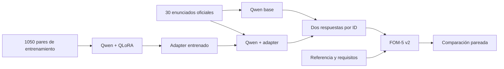

# Deliverable 2 · QLoRA para formulación LP/MILP

**[Abrir el notebook en Colab](https://colab.research.google.com/github/Jose21531/GenAI-Optimization/blob/main/Deliverable%202/Deliverable_2.ipynb)** · [Informe de una página](informe.pdf) · [Fuente LaTeX](informe.tex)

## Problema y método

Formular un problema de localización, asignación o capacidad requiere definir decisiones, dominios, objetivo y restricciones coherentes. En el ejemplo de centros oftalmológicos, una apertura omitida permite asignar demanda a un centro cerrado y un peso poblacional omitido cambia el criterio de atención.

El modelo es **Qwen/Qwen2.5-1.5B-Instruct**, revisión `989aa7980e4cf806f80c7fef2b1adb7bc71aa306`. **QLoRA** (*Quantized Low-Rank Adaptation*) ajusta matrices pequeñas mientras mantiene congelado el modelo base cuantizado en 4 bits. El entrenamiento final usó 1050 ejemplos, una época y GPU T4. El [adapter entrenado](adapter_qlora_qwen25_final.zip) se descarga desde el notebook.

## Archivos para revisión

| Archivo | Contenido |
|---|---|
| [Deliverable_2.ipynb](Deliverable_2.ipynb) | Datos, comparación, demo, generación de 30 + 30, juez FOM-5 v2 y entrenamiento. |
| [data/train_1050_user_only.jsonl](data/train_1050_user_only.jsonl) | 1050 pares: 50 familias × 21 variantes; 315 LP y 735 MILP. |
| [data/benchmark_30.jsonl](data/benchmark_30.jsonl) | 30 enunciados oficiales con referencia y requisitos. El notebook pasa **solo el enunciado** al generador y lee la referencia en el juicio posterior. |
| [output/baseline_respuestas_fom5.csv](output/baseline_respuestas_fom5.csv) | Respuesta completa y juicio por ID del baseline archivado. |
| [output/qlora_respuestas_fom5.csv](output/qlora_respuestas_fom5.csv) | Respuesta completa y juicio por ID de QLoRA. |
| [informe.pdf](informe.pdf) | Informe final; [informe.tex](informe.tex) contiene la fuente. |

Cada CSV de `output/` tiene **31 filas**: 30 problemas del benchmark y el diagnóstico oftalmológico marcado aparte. Las medias principales usan solo las 30 filas con `split=benchmark`. **SHA-256** es una huella de integridad: el notebook verifica que los datos, CSV y adapter descargados coincidan con los publicados.

## Benchmark FOM-5 v2

Un juez Qwen3-14B NF4 recibe el enunciado, la referencia, los requisitos y la respuesta candidata **después** de la generación. Evalúa cinco componentes en escala 0–5: decisiones y dominios (15 %), objetivo (20 %), restricciones (35 %), validez algebraica (15 %) y generalización (15 %). El total es `F = 0.15D + 0.20O + 0.35R + 0.15A + 0.15G`. La cobertura de requisitos limita los componentes pertinentes; una salida sin formulación reconocible tiene tope 1.5/5.

| 30 problemas oficiales | Baseline | QLoRA |
|---|---:|---:|
| FOM-5 v2 medio | 0.5884 | 0.8024 |
| Casos con 0/5 | 21 | 12 |

**14 mejoraron, 8 empataron y 8 empeoraron.** El cambio medio pareado fue +0.2140/5. El análisis remuestreó 10 000 veces las 30 diferencias por ID y obtuvo un IC bootstrap del 95 % de `[-0.2136, +0.7007]`; incluye cero. Los 1050 ejemplos comparten 50 formulaciones canónicas, y el resultado usa una semilla final y un juez automático. El caso de Entrega 1 se presenta aparte: baseline determinista 0.650/5 y QLoRA 3.850/5; la respuesta ajustada todavía omite el peso poblacional en el objetivo.

## Reproducir el video y el experimento

1. Abre el [Colab](https://colab.research.google.com/github/Jose21531/GenAI-Optimization/blob/main/Deliverable%202/Deliverable_2.ipynb), selecciona GPU T4 y ejecuta las secciones **1–3**. Se descargan los datos y el adapter público, se verifican sus SHA-256 y se carga Qwen.
2. Ejecuta la sección **4** durante la grabación. La celda contiene el enunciado oftalmológico, genera las dos respuestas y muestra la referencia y ambas salidas. También guarda las nuevas respuestas en `/content/deliverable_2/output/live_demo.json`.
3. Para reproducir el benchmark, activa `RUN_REGENERATE_30=True` en la sección **5** y luego `RUN_JUDGE_NEW_30=True` en la **6**. Se crean resultados nuevos por ID en Colab. La sección **7** permite repetir el entrenamiento con los 1050 ejemplos.

Los puntajes publicados corresponden a las respuestas guardadas en `output/`. La sección 4 produce dos respuestas nuevas para la demostración.
