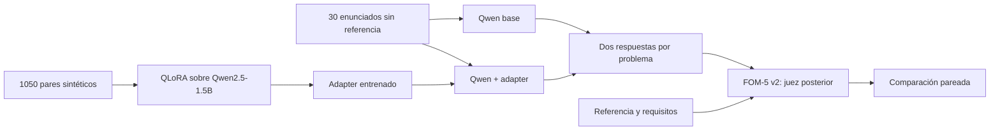

# GenAI-Optimization

Un enunciado de optimización puede describir correctamente una decisión y aun así terminar en un modelo matemático equivocado: basta omitir un vínculo entre variables o cambiar un índice para alterar las soluciones posibles. Este proyecto estudia si un modelo pequeño puede producir **borradores LP/MILP paramétricos y verificables** en una GPU T4. La tarea es formular; la revisión matemática sigue siendo necesaria.

| Entrega | Acceso |
|---|---|
| [Deliverable 1](Deliverable%201/) | [Informe](Deliverable%201/Grupo1_GenAI.pdf) y [notebook](Deliverable%201/Deliverable_1.ipynb): diagnóstico del caso de localización de centros oftalmológicos. |
| [Deliverable 2](Deliverable%202/) | [Informe de una página](Deliverable%202/report/informe.pdf), [notebook](Deliverable%202/Deliverable_2.ipynb), [datos](Deliverable%202/data/), [resultados por caso](Deliverable%202/outputs/) y [guía técnica](Deliverable%202/README.md). |

**[Abrir Deliverable 2 en Google Colab](https://colab.research.google.com/github/Jose21531/GenAI-Optimization/blob/main/Deliverable%202/Deliverable_2.ipynb)** (seleccionar GPU T4). Los datos y el adapter entrenado se descargan del repositorio con verificación SHA-256; basta una cuenta propia de Colab.

Para **reproducir el video**, abre el Colab, ejecuta las secciones **1–3** (instalación, archivos/resultados y carga del modelo), y ejecuta la sección **5**. Esa celda genera una respuesta base y una QLoRA sobre el **mismo caso de Entrega 1**; la siguiente las muestra lado a lado. Las secciones 4 y 6 permiten repetir y juzgar los 30 problemas, pero son corridas largas ajenas al video. La sección 7 permite repetir el entrenamiento.

En el benchmark oficial de **30 entradas**, la media FOM-5 v2 pasó de **0.5884 a 0.8024/5**: 14 casos mejoraron, 8 empataron y 8 empeoraron. El [README técnico](Deliverable%202/README.md) explica la rúbrica, el origen de las respuestas, el intervalo bootstrap y los límites del resultado. La grabación de pantalla se enlazará aquí cuando quede guardada en [`Deliverable 2/video/`](Deliverable%202/video/).
